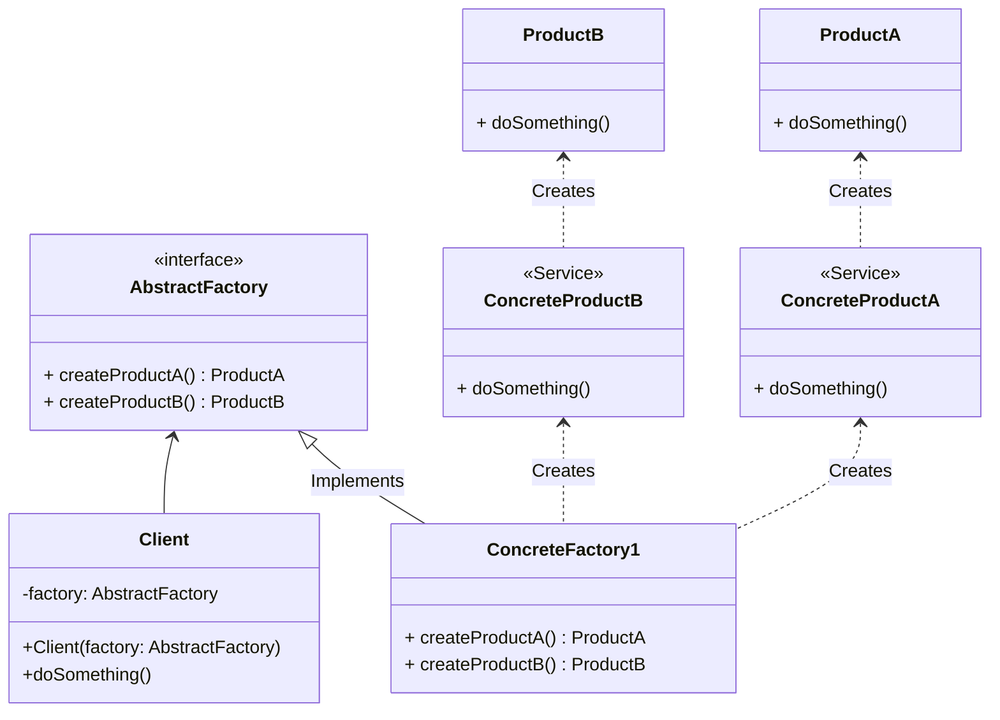

# Abstract Factory
O Abstract Factory é um padrão de projeto de software que faz parte da categoria dos padrões de criação. Ele fornece uma interface para criar famílias de objetos relacionados sem especificar suas classes concretas. Em outras palavras, o Abstract Factory permite que você crie objetos relacionados de maneira coesa e independente da implementação específica, promovendo a flexibilidade e a manutenção do código.

A principal ideia por trás do padrão Abstract Factory é a criação de uma fábrica abstrata que define métodos para criar objetos de diferentes tipos relacionados. Cada implementação concreta da fábrica abstrata corresponde a uma família específica de objetos. Essa fábrica abstrata é responsável por criar objetos consistentes entre si, garantindo que esses objetos funcionem bem juntos.

Principais elementos do Abstract Factory:

1. **Abstract Factory (Fábrica Abstrata)**: Define uma interface para a criação de objetos relacionados, como produtos ou componentes. Esta interface é abstrata e não contém implementações detalhadas. Ela pode incluir vários métodos para criar diferentes tipos de objetos.

2. **Concrete Factory (Fábrica Concreta)**: Implementa a interface da fábrica abstrata e fornece implementações específicas para criar objetos de uma família. Cada fábrica concreta corresponde a uma família de objetos relacionados.

3. **Abstract Product (Produto Abstrato)**: Define uma interface para os objetos que a fábrica produz. Essa interface é abstrata e não contém implementações detalhadas dos produtos.

4. **Concrete Product (Produto Concreto)**: Implementa a interface do produto abstrato e fornece implementações específicas para os objetos criados pela fábrica.

5. **Cliente**: Usa a fábrica abstrata e os produtos abstratos para criar objetos sem precisar conhecer as classes concretas das fábricas ou dos produtos.

### Exemplo do mundo real
Considere a seguinte situação: você necessita implementar um gateway de pagamento e incorporar a aplicação da taxa de imposto a esse gateway. Em vez de desenvolver classes separadas para o gateway e a classe de cálculo de imposto, é possível otimizar esse processo encapsulando a criação dessas duas classes dentro de um padrão Abstract Factory.

### Quando utilizar?

1. **Quando você precisa garantir que os objetos criados sejam compatíveis:** Se você tiver um conjunto de objetos que devem funcionar juntos de maneira coesa, a Abstract Factory garante que todos os objetos criados pela mesma fábrica sejam compatíveis entre si.

2. **Quando você quer isolar a criação de objetos:** A Abstract Factory ajuda a separar o código que cria objetos do código que usa esses objetos. Isso pode facilitar a manutenção e a evolução do sistema, pois você pode alterar a fábrica concreta sem afetar o código que usa os objetos.

3. **Quando você está desenvolvendo um framework:** Os frameworks muitas vezes usam o padrão Abstract Factory para permitir que os desenvolvedores estendam ou substituam componentes sem modificar o código principal do framework.

4. **Quando você precisa suportar múltiplas variantes de um sistema:** Se você está construindo um sistema que precisa funcionar com diferentes famílias de objetos (por exemplo, em diferentes plataformas ou ambientes), a Abstract Factory pode ser usada para criar as instâncias apropriadas com base nas configurações.

5. **Quando você deseja promover a coesão e a flexibilidade:** Usar a Abstract Factory pode levar a um código mais coeso, pois todos os objetos criados por uma fábrica compartilham uma semântica comum. Isso pode tornar o sistema mais flexível e fácil de entender.

### Diagrama
