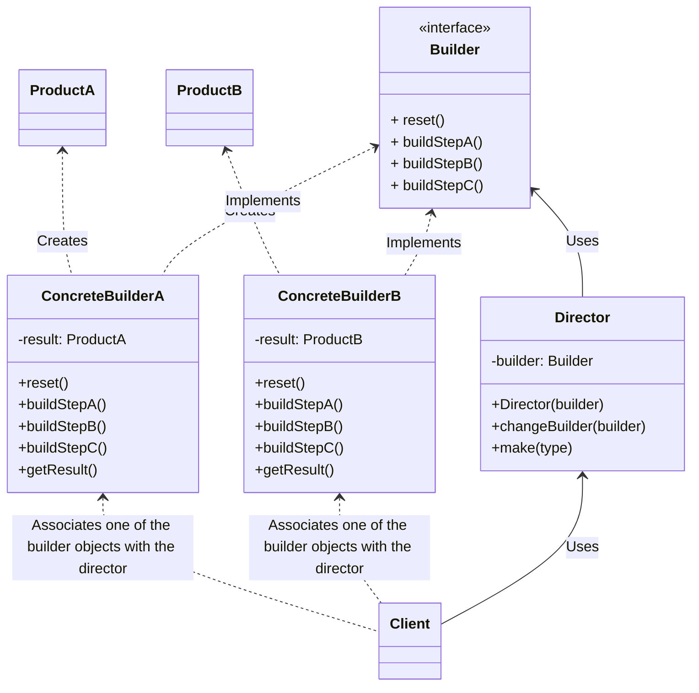

# Builder
O padrão Builder é um padrão de projeto de software que faz parte da categoria dos padrões de criação. O Builder é usado para construir um objeto complexo passo a passo. Ele separa a construção de um objeto complexo de sua representação final, permitindo que o mesmo processo de construção possa criar diferentes representações.

Principais elementos do padrão Builder:
1. **Director (Diretor)**: É responsável por coordenar o processo de construção do objeto complexo. Ele não sabe como construir os objetos, mas dirige o construtor apropriado passo a passo.

2. **Builder (Construtor)**: Define uma interface abstrata para construir as partes individuais de um objeto complexo. Geralmente, ele possui métodos para configurar diferentes aspectos do objeto, como atributos ou partes. Existem implementações concretas do Builder para construir objetos específicos.

3. **Concrete Builder (Construtor Concreto)**: Implementa a interface do Builder e fornece uma implementação concreta para construir um objeto específico. Cada Concrete Builder pode criar uma representação diferente do objeto complexo.

4. **Product (Produto)**: Representa o objeto complexo que está sendo construído. O Builder constrói este objeto e o retorna após a conclusão do processo de construção.

5. **Client (Cliente)**: É responsável por criar uma instância do Director e do Builder adequados e iniciar o processo de construção do objeto complexo. O cliente pode configurar o objeto complexo passo a passo de acordo com suas necessidades.

### Exemplo do mundo real
O padrão de projeto Builder é usado em diversas situações do mundo real, onde a criação de objetos complexos com várias configurações é necessária.

Exemplos mais comuns onde o padrão Builder é recomendado:

1. **Criação de Documentos Complexos:** Em editores de documentos ou processadores de texto, onde você pode criar documentos com várias seções, parágrafos, imagens e outros elementos. O padrão Builder permite criar documentos de maneira estruturada.

2. **Configuração de Objetos Gráficos:** Em bibliotecas gráficas, onde você cria elementos gráficos como gráficos, figuras geométricas ou layouts complexos. O Builder ajuda a configurar e compor esses objetos de maneira flexível.

3. **Criação de Consultas de Banco de Dados:** Em sistemas de gerenciamento de bancos de dados, onde você pode criar consultas SQL complexas com várias cláusulas e condições. O Builder facilita a construção dessas consultas.

4. **Configuração de Objetos de Configuração:** Ao criar objetos de configuração para aplicativos, como arquivos de configuração XML ou JSON, o padrão Builder pode ser usado para criar objetos de configuração personalizados.

5. **Criação de Elementos Gráficos de Interface do Usuário:** Em sistemas de interface do usuário, o Builder é usado para criar janelas, diálogos ou painéis com múltiplos componentes, como botões, caixas de texto e listas.

6. **Criação de Modelos de Emails Personalizados:** Em sistemas de email, onde você pode criar modelos de emails personalizados com cabeçalhos, corpo de texto, anexos e formatação. O Builder ajuda a criar emails de forma estruturada.

7. **Criação de Relatórios Personalizados:** Em sistemas de geração de relatórios, onde os relatórios podem ter cabeçalhos, rodapés, gráficos, tabelas e outros elementos. O Builder facilita a construção desses relatórios.

8. **Criação de Produtos Personalizados em Lojas Online:** Em lojas online, onde os clientes podem personalizar produtos, como computadores ou roupas, com várias opções, cores, tamanhos, etc. O Builder permite criar produtos sob medida.

9. **Construção de Elementos Geométricos em CAD (Computer-Aided Design):** Em aplicativos de design assistido por computador, onde você pode criar objetos 2D ou 3D complexos, como edifícios ou produtos industriais, o Builder é usado para configurar esses elementos.

Essas são apenas algumas das muitas situações onde o padrão Builder é aplicado. Em geral, sempre que você precisa criar objetos complexos e configuráveis, o Builder é uma escolha útil para tornar o processo de construção mais flexível, legível e fácil de gerenciar. Ele separa a construção do objeto de sua representação final, tornando-o altamente adaptável a diferentes contextos.

### Quando utilizar?
O padrão Builder é útil quando você tem um objeto que possui muitos atributos ou configurações opcionais, e você deseja criar instâncias desse objeto de maneira flexível, fornecendo diferentes maneiras de configurá-lo. Ele é particularmente útil quando você tem um construtor com muitos parâmetros, evitando assim a necessidade de construtores com muitos argumentos, o que pode ser difícil de ler e manter.

### Diagrama


### Uso
```php
use Builder\PaymentMethodDirector;
use Builder\ConcretePixPaymentMethodBuilder;
use Builder\ConcreteDebitPaymentMethodBuilder;

$pixDirector = new PaymentMethodDirector(new ConcretePixPaymentMethodBuilder());
$paymentMethod = $pixDirector->make();
var_dump($paymentMethod);

$paymentMethod->changeBuilder(new ConcreteDebitPaymentMethodBuilder())
var_dump($paymentMethod);
```
