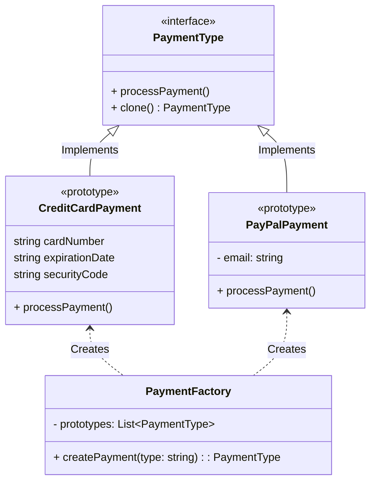

# Prototype
O padrão Prototype é um padrão de projeto de software que faz parte do grupo de padrões de criação. Ele tem o objetivo de criar objetos a partir de objetos já existentes, chamados de "protótipos". O padrão Prototype é útil quando a criação de um objeto é mais eficiente, ou quando os objetos a serem criados têm muitas semelhanças com objetos já existentes.

A ideia central do padrão Prototype é a seguinte:

1. Um objeto (ou conjunto de objetos) é definido como um protótipo. Esse objeto serve como um modelo para a criação de novos objetos.

2. Para criar um novo objeto, em vez de criar um objeto do zero e configurá-lo manualmente, você simplesmente clona (ou copia) o protótipo existente.

3. Após a clonagem, você pode personalizar o objeto clonado conforme necessário, fazendo ajustes nos atributos e comportamento.

### Exemplo do mundo real
O padrão de projeto Prototype é útil em diversas situações do mundo real, onde a clonagem de objetos existentes para criar novos objetos é benéfica.

Exemplos mais comuns onde o padrão Prototype é recomendado:

1. **Criação de Documentos e Relatórios:** Em aplicativos de geração de documentos, onde os documentos podem ter partes comuns e variações. Usar protótipos para criar documentos baseados em modelos existentes economiza tempo e recursos.

2. **Criação de Elementos Gráficos:** Em programas de design gráfico ou CAD (Computer-Aided Design), onde elementos gráficos complexos, como símbolos, gráficos ou figuras, podem ser clonados a partir de protótipos para construir designs mais complexos.

3. **Geração de Objetos de Interface do Usuário:** Em sistemas de interface do usuário, onde janelas, painéis ou componentes de interface de usuário podem ser clonados e personalizados para criar layouts complexos.

4. **Configuração de Produtos Personalizados:** Em lojas online, onde os clientes podem personalizar produtos, como computadores, roupas ou móveis. Protótipos de produtos podem ser clonados e personalizados de acordo com as preferências do cliente.

5. **Criação de Personagens em Jogos:** Em jogos, onde personagens ou inimigos podem ser criados a partir de protótipos com características comuns e depois personalizados com habilidades únicas e atributos.

### Quando utilizar?
O padrão Prototype é particularmente útil quando a criação de objetos é complexa e envolve uma série de etapas ou configurações, e a clonagem de um protótipo é uma maneira eficiente de evitar a redundância e melhorar o desempenho.

O padrão Prototype é comumente usado em linguagens de programação que oferecem suporte a clonagem de objetos, como Java e JavaScript. Além disso, ele é amplamente usado em aplicações que envolvem a criação de documentos, gráficos, elementos de interface do usuário, ou qualquer outro cenário onde a criação de objetos baseados em protótipos existentes é útil.

### Diagrama



### Uso
```php

$book = (new Prototype\ConcreteBook())
            ->setAuthorName('Author Name')
            ->setTitle('Another PHP Book');

$books = [];
for ($i = 0; $i < 100; $i++) {
    $books = clone $book;
}
```