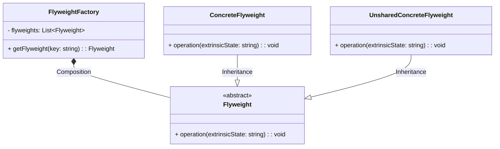

# Flyweight
O padrão de projeto Flyweight é um padrão de design de software que visa otimizar o uso de memória ou recursos computacionais, compartilhando objetos com características idênticas ou semelhantes em vez de criar múltiplas instâncias desses objetos. Ele é especialmente útil quando você tem muitas instâncias de um objeto com parte de seu estado sendo compartilhado (estado intrínseco) e parte sendo única para cada instância (estado extrínseco).

A ideia central do padrão Flyweight é separar o estado intrínseco (compartilhado) do estado extrínseco (único para cada objeto). O estado intrínseco é armazenado em objetos compartilhados (flyweights), enquanto o estado extrínseco é passado como parâmetro para as operações que envolvem o flyweight. Isso permite economizar memória e reduzir a complexidade, uma vez que o estado compartilhado é reutilizado.

Principais componentes do padrão Flyweight:

1. **Flyweight (Flyweight)**: É a interface que define a estrutura do objeto compartilhado. Ela declara um método para operar com o estado extrínseco.

2. **ConcreteFlyweight (Concrete Flyweight)**: Implementa a interface Flyweight e mantém o estado intrínseco compartilhado. É capaz de realizar operações específicas para manipular o estado extrínseco.

3. **FlyweightFactory (Factory)**: É responsável por criar e gerenciar os objetos flyweight. Ele garante que os objetos flyweight sejam compartilhados e reutilizados.

4. **Cliente**: Utiliza os objetos flyweight, passando o estado extrínseco sempre que necessário.

### Exemplo do mundo real
Exemplos do mundo real onde o padrão Flyweight é aplicado incluem processamento de texto, onde objetos como caracteres podem ser compartilhados, jogos de xadrez, onde as peças do tabuleiro são flyweights comuns, ou renderização de gráficos, onde objetos como texturas ou imagens podem ser compartilhados para economizar memória.

### Quando utilizar?
O padrão Flyweight é eficaz quando você tem um grande número de objetos semelhantes e deseja reduzir a utilização de memória, melhorar o desempenho e reduzir o tempo de criação de objetos. Ele é uma das abordagens úteis para otimização em software.

### Diagrama


### Uso
```php
use Flyweight\StoreFlyweight;
use Flyweight\Car;
use Flyweight\CarColor;

$store = new StoreFlyweight;

$celta1 = new Car(
    'PLACA A',
    $store->usingCharacteristics('Chevrolet', 'Celta', CarColor::GREEN)
);

$celta2 = new Car(
    'PLACA B',
    $store->usingCharacteristics('Chevrolet', 'Celta', CarColor::GREEN)
);

if ($celta1->getCharacteristic() === $celta2->getCharacteristic()) {
    var_dump('$celta1->getCharacteristic() is the same object as $celta2->getCharacteristic()');
}
```